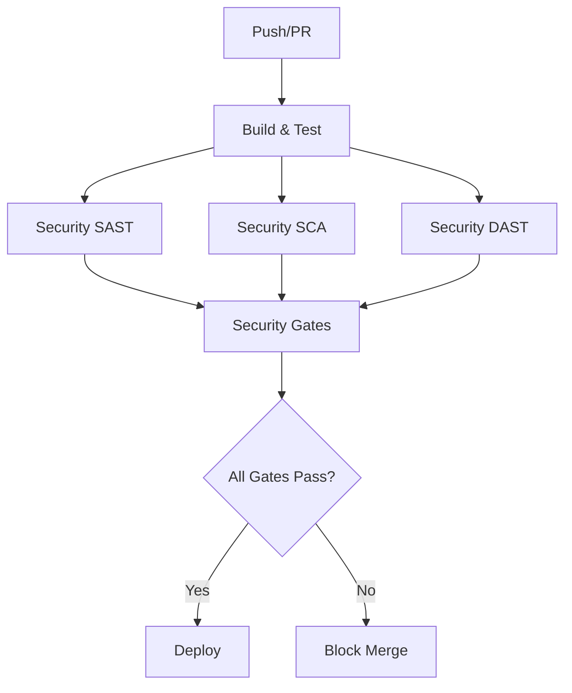

# 🔒 Security-First CI/CD Pipeline

Este documento describe el pipeline de CI/CD implementado para el proyecto Next.js, priorizando seguridad, calidad y velocidad con gates estrictos que bloquean el merge si se detectan vulnerabilidades críticas.

## 📊 Badges de Estado

Agrega estos badges a tu README.md:

```markdown
[](https://github.com/USERNAME/REPO/actions/workflows/ci.yml)
[](https://github.com/USERNAME/REPO/actions/workflows/security.yml)
[](https://codecov.io/gh/USERNAME/REPO)
[](https://github.com/USERNAME/REPO/security)
[](https://github.com/USERNAME/REPO/network/dependencies)
```

## 🚀 Pipeline Overview

### Estrategia de Seguridad

El pipeline implementa una estrategia de **"Security by Design"** con múltiples capas de protección:

1. **Gates de Calidad**: Cobertura ≥80%, linting, type checking
2. **Gates de Seguridad**: SAST (Semgrep), SCA (Trivy + pnpm audit), DAST (ZAP)
3. **Gates de Deployment**: Solo permite merge si todos los checks pasan
4. **Monitoreo Continuo**: Scans programados diarios y notificaciones

### Flujo del Pipeline



## 🔧 Configuración de Secrets

### GitHub Secrets Requeridos

Configura estos secrets en `Settings > Secrets and variables > Actions`:

| Secret | Descripción | Requerido | Ejemplo |
|--------|-------------|-----------|---------|
| `SEMGREP_APP_TOKEN` | Token de Semgrep para análisis SAST | ✅ | `semgrep_xxxxxxxxxxxx` |
| `JWT_SECRET` | Secret para JWT en producción | ✅ | `your-super-secret-jwt-key-32-chars` |
| `CODECOV_TOKEN` | Token de Codecov para cobertura | ⚠️ | `xxxxxxxx-xxxx-xxxx-xxxx-xxxxxxxxxxxx` |

### GitLab Variables Requeridas

Configura estas variables en `Settings > CI/CD > Variables`:

| Variable | Descripción | Protegida | Masked |
|----------|-------------|-----------|--------|
| `SEMGREP_APP_TOKEN` | Token de Semgrep | ✅ | ✅ |
| `JWT_SECRET` | Secret para JWT | ✅ | ✅ |

## 🛠️ Comandos Locales

### Análisis de Seguridad Local

```bash
# Análisis SAST completo
pnpm sec:sast

# Análisis SCA (dependencias)
pnpm sec:sca

# Análisis DAST (requiere app corriendo)
pnpm sec:dast

# Análisis completo de seguridad
pnpm sec:full

# Verificar todas las comprobaciones de seguridad
pnpm sec:check

# Arreglar vulnerabilidades automáticamente
pnpm sec:audit-fix
```

### Comandos de Desarrollo

```bash
# Tests con cobertura y umbrales
pnpm test:ci

# Linting y corrección automática
pnpm lint:fix

# Type checking
pnpm typecheck

# Build de producción
pnpm build
```

## 📋 Checklist de Verificación

### ✅ Para Pull Requests

Antes de hacer merge, verifica que:

- [ ] **Build Status**: ✅ Verde en GitHub Actions
- [ ] **Coverage**: ≥80% en todas las métricas
- [ ] **Security SAST**: 0 findings High/Critical
- [ ] **Security SCA**: 0 vulnerabilidades Critical
- [ ] **Security Audit**: 0 vulnerabilidades High/Critical
- [ ] **Linting**: Sin errores de ESLint
- [ ] **Type Check**: Sin errores de TypeScript
- [ ] **Tests**: Todos los tests pasan

### ❌ Criterios de Fallo

El pipeline **FALLARÁ** si:

- Cobertura < 80% en cualquier métrica
- Semgrep encuentra findings High/Critical
- Trivy detecta vulnerabilidades Critical
- pnpm audit encuentra vulnerabilidades High/Critical sin resolver
- Errores de linting o type checking
- Tests fallan

### 🚨 Alertas de Seguridad

Recibirás notificaciones si:

- Se detectan nuevas vulnerabilidades
- La cobertura cae por debajo del umbral
- Fallan los análisis de seguridad programados
- Se detectan secretos en el código

## 🔍 Interpretación de Resultados

### Reportes SARIF

Los reportes SARIF se suben automáticamente al **Security tab** de GitHub:

1. Ve a `Security > Code scanning alerts`
2. Revisa los findings de Semgrep y Trivy
3. Corrige los issues marcados como High/Critical
4. Los issues Medium/Low son informativos

### Cobertura de Tests

```bash
# Ver reporte de cobertura local
pnpm test:coverage
open coverage/index.html
```

Métricas objetivo:
- **Lines**: ≥80%
- **Branches**: ≥80%
- **Functions**: ≥80%
- **Statements**: ≥80%

### Vulnerabilidades de Dependencias

```bash
# Ver vulnerabilidades detalladas
pnpm audit

# Arreglar automáticamente
pnpm audit --fix

# Ver solo vulnerabilidades High/Critical
pnpm audit --audit-level=high
```

## 🚀 Cómo Escalar el Pipeline

### 1. CodeQL Integration

```yaml
# Agregar a .github/workflows/ci.yml
- name: Initialize CodeQL
  uses: github/codeql-action/init@v3
  with:
    languages: javascript

- name: Perform CodeQL Analysis
  uses: github/codeql-action/analyze@v3
```

### 2. Container Image Scanning

```yaml
# Agregar después del build
- name: Build Docker image
  run: docker build -t app:${{ github.sha }} .

- name: Scan Docker image
  uses: aquasecurity/trivy-action@master
  with:
    image-ref: 'app:${{ github.sha }}'
    format: 'sarif'
    output: 'trivy-image.sarif'
```

### 3. OIDC para AWS/GCP

```yaml
# Configurar OIDC para deployment seguro
- name: Configure AWS credentials
  uses: aws-actions/configure-aws-credentials@v4
  with:
    role-to-assume: ${{ secrets.AWS_ROLE_ARN }}
    aws-region: us-east-1
```

### 4. Environments Protegidos

```yaml
# En .github/workflows/ci.yml
deploy:
  environment: production
  environment:
    name: production
    protection_rules:
      - type: required_reviewers
        required_reviewers: 2
      - type: wait_timer
        wait_timer: 5
```

### 5. Notificaciones Avanzadas

```yaml
# Slack notifications
- name: Notify Slack
  uses: 8398a7/action-slack@v3
  with:
    status: ${{ job.status }}
    channel: '#security-alerts'
    webhook_url: ${{ secrets.SLACK_WEBHOOK }}
```

## 🔧 Troubleshooting

### Problemas Comunes

**1. Semgrep no encuentra reglas**
```bash
# Verificar configuración
semgrep --config=auto --dry-run .
```

**2. Trivy falla en CI**
```bash
# Ejecutar localmente
trivy fs --format table .
```

**3. pnpm audit falla**
```bash
# Ver vulnerabilidades específicas
pnpm audit --json | jq '.advisories'
```

**4. Cobertura baja**
```bash
# Ver qué archivos no están cubiertos
pnpm test:coverage
# Revisar coverage/index.html
```

### Logs y Debugging

```bash
# Ver logs detallados en GitHub Actions
# Ve a Actions > [Workflow] > [Job] > [Step]

# Debug local
DEBUG=* pnpm test:ci
```

## 📚 Recursos Adicionales

- [Semgrep Rules](https://semgrep.dev/rules)
- [Trivy Documentation](https://aquasecurity.github.io/trivy/)
- [OWASP Top 10](https://owasp.org/www-project-top-ten/)
- [GitHub Security Best Practices](https://docs.github.com/en/code-security)
- [Next.js Security](https://nextjs.org/docs/advanced-features/security-headers)

## 🤝 Contribución

Para contribuir al pipeline:

1. Fork el repositorio
2. Crea una rama feature: `git checkout -b feature/improve-pipeline`
3. Haz tus cambios y tests
4. Asegúrate de que todos los gates pasen
5. Crea un Pull Request

---

**⚠️ Importante**: Este pipeline está diseñado para ser estricto por seguridad. Si necesitas hacer cambios que temporalmente rompan los gates, coordina con el equipo de seguridad primero.
